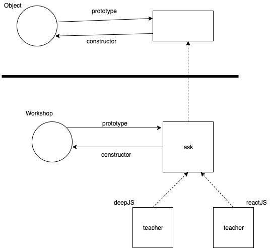

## Prototypal Class

The following snippet resembles a class as implemented using prototypes.
```javascript
function Workshop(teacher) {
  this.teacher = teacher;
}

Workshop.prototype.ask = function(question){
  console.log(this.teacher,question);
}

var deepJS = new Workshop("shu");
var reactJS = new Workshop("kyle");

deepJS.ask("what");
//shu what

reactJS.ask("why");
// kyle why
```
</br>

The prototype chain for the above snippet is shown below:
</br> (Circles are functions and squares are objects.)

</br></br>



At the top level of the prototype chain is hierarchy is the __Object__ object. It's own prototype points to null as there is nothing above it.

```javascript
console.log(Object.prototype);
//null
```

</br></br>

## Dunder proto
Dunder proto i.e. Object.__proto__  is used to move one object up the prototype chain. Dunder proto is basically a getter function in Object.prototype
```javascript
console.log(
  deepJS.constructor === Workshop
); // true
console.log(
  deepJS.__proto__ === Workshop.prototype
); // (dunder proto) true

console.log(
  Object.getPrototypeOf(deepJS) === Workshop.prototype
); // true
```

</br></br>

## Shadowing of prototypes
Here, we are adding a ask function to the deepJS object when there already is an ask function in the prototype of Workshop.
The following code would lead to an infinite recursion as it keeps calling the ask function in the deepJS object.

```javascript
function Workshop(teacher) {
  this.teacher = teacher;
}

Workshop.prototype.ask = function(question){
  console.log(this.teacher,question);
}

var deepJS = new Workshop("shu");
deepJS.ask = function(question) {
  this.ask(question);
}
deepJS.ask("Infinite recursion");
```
</br>
The following fix can allow polymorphism to be performed:

```javascript
function Workshop(teacher) {
  this.teacher = teacher;
}

Workshop.prototype.ask = function(question){
  console.log(this.teacher,question);
}

var deepJS = new Workshop("shu");
deepJS.ask = function(question) {
  this.__proto__.ask.call(this,question);
}
deepJS.ask("why");
```

</br></br>

## Prototypal inheritance
Inheritance can be performed in prototypes by liking their objects together.
```javascript
function Workshop(teacher) {
  this.teacher = teacher;
}

Workshop.prototype.ask = function(question){
  console.log(this.teacher,question);
};

function AnotherWorkshop(teacher) {
  Workshop.call(this,teacher);
}

AnotherWorkshop.prototype = Object.create(Workshop.prototype);

AnotherWorkshop.prototype.speakUp = function(msg) {
  this.ask(msg.toUpperCase());
};

var aa = new AnotherWorkshop("kyle");
aa.speakUp("inheritance");
// kyle INHERITANCE
```


